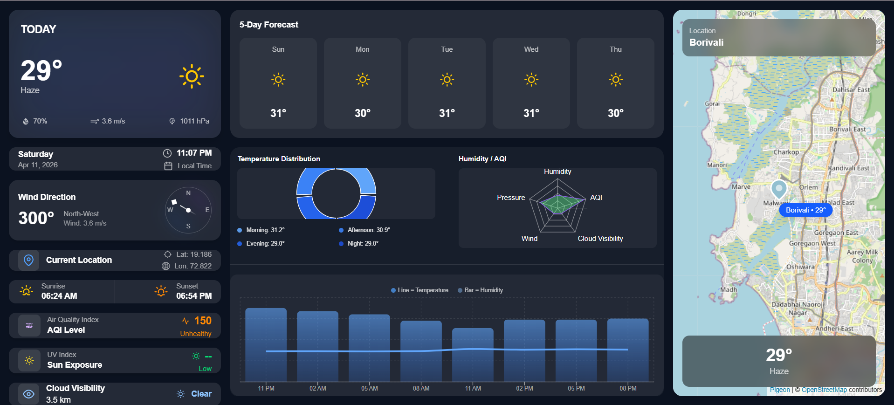

# AMARIS - AI-Powered Intelligence Platform

AMARIS is an intelligent, open web platform that unites conversational AI, live global news, and real-time weather analytics. Built for builders, thinkers, and explorers, AMARIS transforms how you interact with real-time data using speed, clarity, and context.


## Features

- **Interactive Intelligence Chat:** Engage with an AI assistant powered by Groq and Llama 3.1. Get instant, context-aware answers to your queries.
- **Real-Time Weather Dashboard:** View current weather data, 5-day forecasts, AQI (Air Quality Index), UV index, and an interactive map powered by OpenWeatherMap and Pigeon Maps.
- **Live News Feed:** Stay updated with a beautifully designed global news dashboard that integrates with NewsData.io, equipped with category and country filters.
- **Dynamic 3D Earth UI:** Features a high-performance 3D interactive earth rendering in the hero section using Three.js and React Three Fiber.
- **Responsive & Modern Design:** Crafted using Tailwind CSS v4 to guarantee extremely premium visual excellence, utilizing dark modes, subtle micro-animations, and striking visual elements.

## Media


*Real-time Weather Dashboard with Interactive Map and Analytical Charts*

## Tech Stack
- **Framework:** [Next.js](https://nextjs.org) 16
- **Language:** JavaScript & React 19
- **Styling:** [Tailwind CSS Custom Build v4](https://tailwindcss.com/)
- **AI Integration:** [Groq API](https://groq.com) implementation via OpenAI Node Package. Model: Llama-3.1-8b-instant
- **Weather API:** [OpenWeatherMap API](https://openweathermap.org/) (Data & Onecall APIs)
- **News API:** [NewsData.io](https://newsdata.io/)
- **Maps:** [Pigeon Maps](https://pigeon-maps.js.org/)
- **Charts:** [Recharts](https://recharts.org/)
- **3D Visualization:** React Three Fiber 

## Getting Started

First, install the dependencies, you can use `npm`, `yarn`, `pnpm` or `bun`:

```bash
npm install
```

### Environment Variables
Create a `.env.local` file in the root `amaris` directory and add your API keys:

```
GROQ_API_KEY=your_groq_api_key_here
NEXT_PUBLIC_OPENWEATHER_API_KEY=your_openweathermap_api_key_here
NEXT_PUBLIC_NEWSDATA_API_KEY=your_newsdata_api_key_here
WEATHER_KEY=your_openweathermap_api_key_here
NEWS_KEY=your_newsdata_api_key_here
```

### Run Development Server
Start the development server:

```bash
npm run dev
# or
yarn dev
# or
pnpm dev
# or
bun dev
```

Open [http://localhost:3000](http://localhost:3000) with your browser to see the combined platform in action.

## Project Structure
- **/src/app:** Contains Next.js application routes, API routes (e.g. `/api/chat`), and main pages for Hero, Chat, News, and Weather.
- **/src/components:** Houses reusable components including Navbar, comprehensive Hero sections, Weather layout mapping features, etc.
- **/public:** Static assets including 3D globe textures and embedded images (`images/img1.jpeg`, `img2.jpeg`, etc.)

## Contribution
AMARIS is built for collaboration. We welcome contributions, whether it’s new integrations, expanding AI workflows, or UI improvements. Read through the codebase or get in contact using our interactive `GetInTouch` page to propose feedback!
